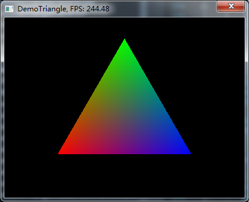
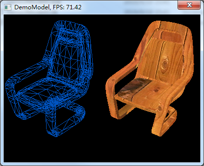
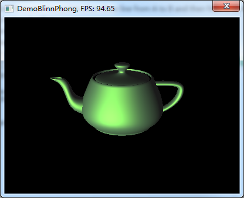
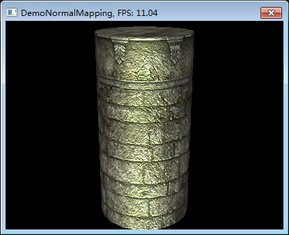
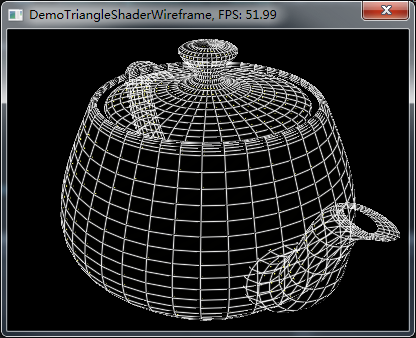
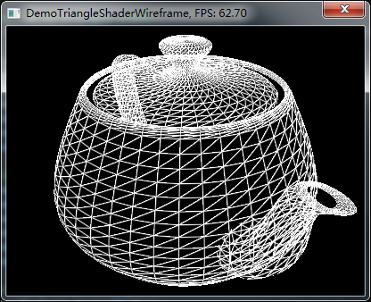
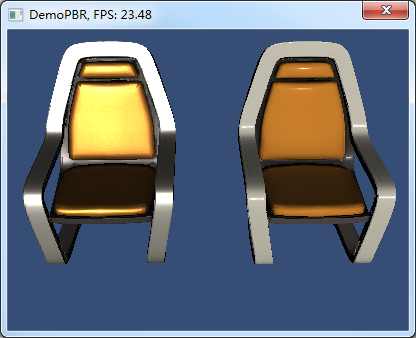
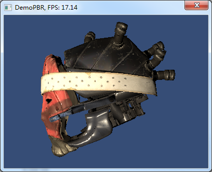

# YwSoftRenderer
Implementing a Soft Renderer for Learning CG.

### About
Mostly coming from [Muli3D](http://muli3d.sourceforge.net/), improved by my understanding. It is still a long and hard trip, but worthwhile.

### Note
Code in `DeprecatedCode` folder is obsolete, only used for reference and will be removed later.

### Build
[Premake5](https://premake.github.io/) is used to build the project, so you need to download a [Premake5](https://premake.github.io/) execuatable file and put it into the project root directory. 

Next, open a command window and type the generating command, e.g. 

```shell
premake5 vs2017
```

or 

```shell
premake5 vs2015
```

(Currently only support `Windows` platform, other platforms like `OSX` and `Linux` is still on the schedule.)

After executing the command `"premake5 vs2017"`, you can find the `Visual Studio` solution files at `"$(ProjectRoot)/Workspace/vs2017/YwSoftRenderer.sln"`, open it with `Visual Studio` and build the solution, all demo executable files are located at `"$(ProjectRoot)/Build/YwSoftRenderer/"`.

### Progress
- [x] Math support.
- [x] Base rasterization and rendering stuffs as [Muli3D](http://muli3d.sourceforge.net/) supported.
- [x] [Premake5](https://premake.github.io/) support.
- [x] `Input` module.
- [x] `Stencil Buffer` support.
- [x] `State Block` optimize with pooling.
- [x] `Model Data Loading` module.
- [x] `Resource and IO` module.
- [x] `Texture Data Loading` module.
- [x] More `Basic` demos.
- [x] Basic `Shading with Light` demo (Blinn-Phong, Normal-Mapping).
- [x] `Triangle Shader` demo.
- [x] `PBR` demo.
- [x] `Alpha Blending` support.
- [x] `Alpha Test` support.
- [ ] `Triangle Shader with Dynamic Vertex Generating` support.
- [ ] `Material File` support.
- [ ] `IBL` support. **[Working on...]**
- [ ] `Linear Color Space` support.
- [ ] `MSAA` support.
- [ ] `Skeletal Animation` support.
- [ ] `Scene Space Managment` module.
- [ ] `Dynamic Shadow` demo.
- [ ] `Triangle Subdivide` demo.
- [ ] `Postprocess Effect` demo.
- [ ] `Log` module.
- [ ] `Low Level Memory Pool` support.
- [ ] `Linux` support
- [ ] `Mac OS X` support.
- [ ] `Global Illumination` support.
- [ ] `Raytracing Core and Raytracing Shader` support.
- [ ] `Custom Shader Compiler and Runtime` support.
- [ ] Something unknown...

### Examples

#### Demo 1: Triangle


#### Demo 2: Model


#### Demo 3: Blinn Phong


#### Demo 4: Normal Mapping


#### Demo 5: Triangle Shader Wireframe
  

#### Demo 6: PBR (Unity BRDF 1: Desney Diffuse + Torrance-Sparrow Specular (D=GGX,F=Schlick,V=Smith), IBL is wroking on.)
 
