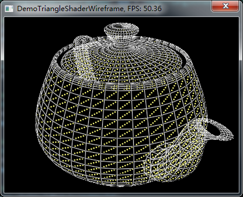

# YwSoftRenderer
Implementing a Soft Renderer for Learning CG.

### About
Mostly coming from [Muli3D](http://muli3d.sourceforge.net/), improved by my understanding. It is still a long and hard trip, but worthwhile.

### Note
Code in `DeprecatedCode` folder is obsolete, only used for reference and will be removed later.

### Progress
- [x] Math support.
- [x] Base rasterization and rendering stuffs as [Muli3D](http://muli3d.sourceforge.net/) supported.
- [x] [Premake5](https://premake.github.io/) support.
- [x] `Input` module.
- [x] `Stencil Buffer` support.
- [x] `State Block` optimize with pooling.
- [x] `Model Data Loading` module.
- [x] `Resource and IO` module.
- [x] `Texture Data Loading` module.
- [x] More `Basic` demos.
- [x] Basic `Shading with Light` demo (Blinn-Phong, Normal-Mapping).
- [x] `Triangle Shader` demo.
- [ ] `PBR` demo. **[Working on...]**
- [ ] `Alpha Blending` support.
- [ ] `Triangle Shader with Dynamic Vertex Generating` support.
- [ ] `Shading with Light and Material` module.
- [ ] `MSAA` module.
- [ ] `Log` module.
- [ ] `Low Level Memory Pool` support.
- [ ] `Linux` support
- [ ] `Mac OS X` support.
- [ ] Maybe a `Custom Shader Compiler and Runtime` support.
- [ ] Something unknown...

### Examples

#### Demo 1: Triangle

#### Demo 2: Model

#### Demo 3: Blinn Phong

#### Demo 4: Normal Mapping

#### Demo 5: Triangle Shader Wireframe
  

#### Demo 6: PBR (Unity BRDF 1: Desney Diffuse + Torrance-Sparrow Specular (D=GGX,F=Schlick,V=Smith), IBL is wroking on.)
 
